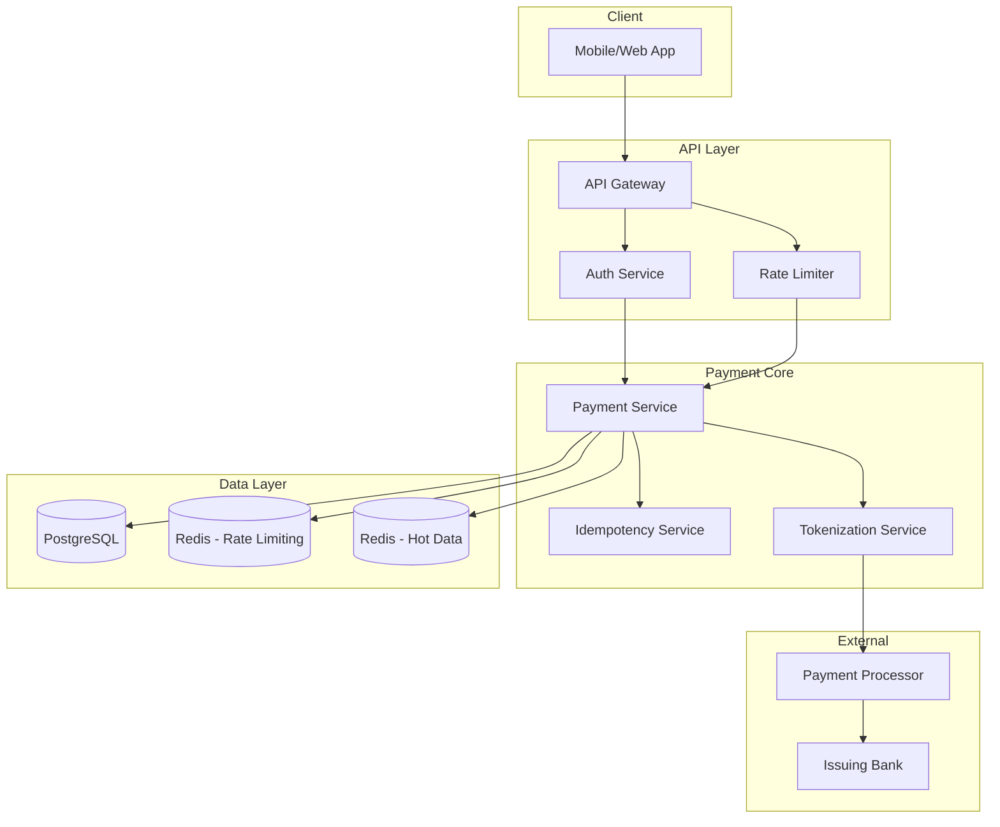

# System Design Case Study: Payment System (Like Stripe)

> A comprehensive walkthrough of designing a payment system at scale, with requirements, API design, capacity planning, failure analysis, and production considerations.

---

## 1. Requirements Analysis

### 1.1 Functional Requirements

```
┌─────────────────────────────────────────────────────────────────────────┐
│                    FUNCTIONAL REQUIREMENTS                               │
├─────────────────────────────────────────────────────────────────────────┤
│                                                                          │
│  F1: Payment Processing                                                │
│      • Support credit/debit cards, ACH, wire transfers                │
│      • Process one-time payments and subscriptions                    │
│      • Support multiple currencies (USD, EUR, GBP, etc.)              │
│                                                                          │
│  F2: Authentication & Security                                        │
│      • PCI DSS compliance required                                    │
│      • Tokenization of card data                                      │
│      • 3D Secure verification                                         │
│                                                                          │
│  F3: Idempotency                                                      │
│      • Prevent duplicate charges                                       │
│      • Client-provided idempotency keys                                │
│                                                                          │
│  F4: Refunds & Disputes                                               │
│      • Full and partial refunds                                        │
│      • Dispute handling (chargebacks)                                  │
│      • Refund timing rules                                             │
│                                                                          │
│  F5: Webhooks & Notifications                                          │
│      • Real-time payment event notifications                           │
│      • Webhook retry logic                                             │
│                                                                          │
│  F6: Reporting & Reconciliation                                        │
│      • Daily settlement reports                                        │
│      • Transaction search and export                                    │
│      • Accounting integrations                                         │
│                                                                          │
└─────────────────────────────────────────────────────────────────────────┘
```

### 1.2 Non-Functional Requirements

```
┌─────────────────────────────────────────────────────────────────────────┐
│                    NON-FUNCTIONAL REQUIREMENTS                          │
├─────────────────────────────────────────────────────────────────────────┤
│                                                                          │
│  SCALABILITY:                                                          │
│  • 100M transactions/day                                              │
│  • 10,000 transactions/second peak                                    │
│  • 99.999% reliability (financial transactions cannot be lost)       │
│                                                                          │
│  LATENCY:                                                              │
│  • Payment authorization: p99 < 200ms                                │
│  • Payment confirmation: p99 < 500ms                                  │
│  • Dashboard queries: p99 < 2s                                        │
│                                                                          │
│  CONSISTENCY:                                                          │
│  • STRONG consistency required (this is money!)                       │
│  • No duplicate charges under any circumstance                         │
│  • Exactly-once semantics                                             │
│                                                                          │
│  AVAILABILITY:                                                         │
│  • 99.99% uptime (52 minutes downtime/year)                          │
│  • Zero data loss SLA                                                 │
│                                                                          │
│  SECURITY:                                                             │
│  • PCI DSS Level 1                                                    │
│  • All data encrypted at rest and in transit                          │
│  • SOC 2 Type II                                                      │
│                                                                          │
│  COMPLIANCE:                                                           │
│  • PCI DSS                                                            │
│  • PSD2 (EU)                                                          │
│  • GDPR                                                               │
│                                                                          │
└─────────────────────────────────────────────────────────────────────────┘
```

---

## 2. Capacity Estimation

### 2.1 QPS and Storage

```
┌─────────────────────────────────────────────────────────────────────────┐
│                    CAPACITY ESTIMATION                                  │
├─────────────────────────────────────────────────────────────────────────┤
│                                                                          │
│  TRANSACTION VOLUME:                                                   │
│  ─────────────────                                                      │
│  • Daily transactions: 100M                                            │
│  • Peak QPS: 10,000                                                   │
│  • Average transaction size: $50                                       │
│                                                                          │
│  STORAGE:                                                              │
│  ────────                                                              │
│  • Transaction records: 100M/day × 365 days × 7 years                 │
│  • = 255.5 billion records                                            │
│  • Average record: ~2KB (with metadata)                               │
│  • = ~500TB primary storage                                           │
│  • Plus indexes, logs: ~2PB total                                     │
│                                                                          │
│  API QPS:                                                             │
│  ────────                                                             │
│  • Charge API: 10,000 QPS                                            │
│  • Webhook delivery: 50,000 QPS (many per transaction)                │
│  • Dashboard queries: 1,000 QPS                                       │
│                                                                          │
│  NETWORK:                                                             │
│  ────────                                                             │
│  • API response size: ~1KB                                            │
│  • 10K QPS × 1KB = 10MB/s = 80Gbps                                  │
│                                                                          │
│  DATABASE CONNECTIONS:                                                 │
│  ─────────────────────                                                │
│  • Each transaction: 1-3 DB queries                                   │
│  • 10K TPS × 3 = 30K queries/sec                                     │
│  • Connection pool: 100-200 connections with PgBouncer               │
│                                                                          │
└─────────────────────────────────────────────────────────────────────────┘
```

---

## 3. API Design

### 3.1 Core Endpoints

```
┌─────────────────────────────────────────────────────────────────────────┐
│                    API DESIGN - REST                                    │
├─────────────────────────────────────────────────────────────────────────┤
│                                                                          │
│  PAYMENTS:                                                             │
│  ─────────                                                              │
│  POST   /v1/payment_intents                                           │
│          Create a payment intent before charging                       │
│                                                                          │
│          Request:                                                      │
│          {                                                             │
│            "amount": 5000,         // in cents                        │
│            "currency": "usd",                                           │
│            "customer": "cus_123",                                      │
│            "payment_method": "pm_123",                                 │
│            "confirm": true,                                            │
│            "idempotency_key": "key_abc",                              │
│            "metadata": { "order_id": "12345" }                        │
│          }                                                             │
│                                                                          │
│          Response:                                                     │
│          {                                                             │
│            "id": "pi_abc123",                                         │
│            "amount": 5000,                                            │
│            "currency": "usd",                                         │
│            "status": "succeeded",                                      │
│            "charge": "ch_abc123",                                     │
│            "created": 1699999999                                      │
│          }                                                             │
│                                                                          │
│  ───────────────────────────────────────────────────────────────────    │
│                                                                          │
│  POST   /v1/charges                                                    │
│          Direct charge (legacy, prefer PaymentIntents)                   │
│                                                                          │
│  GET    /v1/charges/:id                                               │
│          Retrieve charge details                                        │
│                                                                          │
│  POST   /v1/charges/:id/refund                                        │
│          Create a refund                                                │
│                                                                          │
│  ───────────────────────────────────────────────────────────────────    │
│                                                                          │
│  CUSTOMERS:                                                            │
│  ──────────                                                            │
│  POST   /v1/customers                                                  │
│  GET    /v1/customers/:id                                             │
│  POST   /v1/customers/:id/payment_methods                             │
│                                                                          │
│  ───────────────────────────────────────────────────────────────────    │
│                                                                          │
│  WEBHOOKS:                                                             │
│  ─────────                                                             │
│  POST   /v1/webhook_endpoints                                          │
│          Create webhook endpoint                                        │
│                                                                          │
│  Events: payment_intent.succeeded, charge.refunded, etc.               │
│                                                                          │
│  ───────────────────────────────────────────────────────────────────    │
│                                                                          │
│  IDEMPOTENCY:                                                          │
│  ────────────                                                          │
│  Required for all POST requests                                        │
│  Header: Idempotency-Key: <unique-key>                                │
│  Key is valid for 24 hours                                            │
│                                                                          │
└─────────────────────────────────────────────────────────────────────────┘
```

---

## 4. Data Model

### 4.1 Core Schema

```sql
-- Customers
CREATE TABLE customers (
    id UUID PRIMARY KEY DEFAULT gen_random_uuid(),
    stripe_id VARCHAR(50) UNIQUE NOT NULL,
    email VARCHAR(255) NOT NULL,
    name VARCHAR(255),
    metadata JSONB,
    created_at TIMESTAMP WITH TIME ZONE DEFAULT NOW(),
    updated_at TIMESTAMP WITH TIME ZONE DEFAULT NOW()
);

-- Payment Methods (tokenized)
CREATE TABLE payment_methods (
    id UUID PRIMARY KEY DEFAULT gen_random_uuid(),
    stripe_id VARCHAR(50) UNIQUE NOT NULL,
    customer_id UUID REFERENCES customers(id),
    type VARCHAR(50) NOT NULL,  -- card, bank_account, etc.
    tokenized_data JSONB NOT NULL,  -- never store raw card data!
    is_default BOOLEAN DEFAULT FALSE,
    created_at TIMESTAMP WITH TIME ZONE DEFAULT NOW()
);

-- Transactions (the core ledger)
CREATE TABLE transactions (
    id UUID PRIMARY KEY DEFAULT gen_random_uuid(),
    stripe_id VARCHAR(50) UNIQUE NOT NULL,
    customer_id UUID REFERENCES customers(id),
    payment_method_id UUID REFERENCES payment_methods(id),
    
    -- Money
    amount INTEGER NOT NULL,  -- in cents
    currency VARCHAR(3) NOT NULL,
    
    -- Status
    status VARCHAR(50) NOT NULL,  -- pending, processing, succeeded, failed
    type VARCHAR(50) NOT NULL,  -- charge, refund, dispute
    
    -- Processor response
    processor_id VARCHAR(100),  -- from payment processor
    processor_response JSONB,
    
    -- Idempotency
    idempotency_key VARCHAR(100) UNIQUE,
    
    -- Timing
    created_at TIMESTAMP WITH TIME ZONE DEFAULT NOW(),
    processed_at TIMESTAMP WITH TIME ZONE,
    
    -- Audit
    metadata JSONB,
    
    -- Indexes
    CONSTRAINT positive_amount CHECK (amount > 0)
);

CREATE INDEX idx_transactions_customer ON transactions(customer_id);
CREATE INDEX idx_transactions_status ON transactions(status);
CREATE INDEX idx_transactions_created ON transactions(created_at);

-- Refunds
CREATE TABLE refunds (
    id UUID PRIMARY KEY DEFAULT gen_random_uuid(),
    stripe_id VARCHAR(50) UNIQUE NOT NULL,
    transaction_id UUID REFERENCES transactions(id),
    amount INTEGER NOT NULL,
    reason VARCHAR(50),
    status VARCHAR(50),
    created_at TIMESTAMP WITH TIME ZONE DEFAULT NOW()
);

-- Idempotency Keys (for deduplication)
CREATE TABLE idempotency_keys (
    key VARCHAR(100) PRIMARY KEY,
    request_hash VARCHAR(64) NOT NULL,
    response_code INTEGER,
    response_body JSONB,
    created_at TIMESTAMP WITH TIME ZONE DEFAULT NOW(),
    expires_at TIMESTAMP WITH TIME ZONE NOT NULL
);
```

---

## 5. Architecture

### 5.1 High-Level Design



### 5.2 Payment Flow

```
┌─────────────────────────────────────────────────────────────────────────┐
│                    PAYMENT FLOW - WRITE PATH                             │
├─────────────────────────────────────────────────────────────────────────┤
│                                                                          │
│  1. CLIENT REQUEST                                                     │
│  ┌─────────────────────────────────────────────────────────────────┐   │
│  │ POST /v1/payment_intents                                        │   │
│  │ Idempotency-Key: unique_key_123                                │   │
│  │ { amount: 5000, currency: "usd", payment_method: "pm_xxx" }   │   │
│  └─────────────────────────────────────────────────────────────────┘   │
│                              │                                          │
│                              ▼                                          │
│                                                                          │
│  2. IDEMPOTENCY CHECK                                                  │
│  ┌─────────────────────────────────────────────────────────────────┐   │
│  │ Check if key exists in idempotency table                        │   │
│  │ If exists: return cached response (prevent duplicate charge)    │   │
│  │ If not: continue                                               │   │
│  └─────────────────────────────────────────────────────────────────┘   │
│                              │                                          │
│                              ▼                                          │
│                                                                          │
│  3. VALIDATION                                                         │
│  ┌─────────────────────────────────────────────────────────────────┐   │
│  │ • Validate amount > 0                                           │   │
│  │ • Validate currency supported                                  │   │
│  │ • Validate payment method exists and belongs to customer        │   │
│  │ • Check for fraud signals                                      │   │
│  └─────────────────────────────────────────────────────────────────┘   │
│                              │                                          │
│                              ▼                                          │
│                                                                          │
│  4. CREATE TRANSACTION (IN DB)                                         │
│  ┌─────────────────────────────────────────────────────────────────┐   │
│  │ BEGIN TRANSACTION;                                             │   │
│  │ INSERT INTO transactions (...) VALUES (...);  -- status='pending'│  │
│  │ COMMIT;                                                        │   │
│  └─────────────────────────────────────────────────────────────────┘   │
│                              │                                          │
│                              ▼                                          │
│                                                                          │
│  5. TOKENIZATION                                                       │
│  ┌─────────────────────────────────────────────────────────────────┐   │
│  │ Replace payment method token with processor token               │   │
│  │ (Never store raw card numbers - PCI DSS)                      │   │
│  └─────────────────────────────────────────────────────────────────┘   │
│                              │                                          │
│                              ▼                                          │
│                                                                          │
│  6. PROCESSOR CALL                                                     │
│  ┌─────────────────────────────────────────────────────────────────┐   │
│  │ Call payment processor (Stripe, Adyen, etc.)                   │   │
│  │ with tokenized payment method                                  │   │
│  └─────────────────────────────────────────────────────────────────┘   │
│                              │                                          │
│              ┌─────────────┴─────────────┐                              │
│              ▼                           ▼                              │
│      ┌───────────────┐           ┌───────────────┐                     │
│      │ SUCCESS       │           │ FAILED       │                     │
│      │               │           │               │                     │
│      │ UPDATE status │           │ UPDATE status │                     │
│      │ = 'succeeded' │           │ = 'failed'    │                     │
│      │ + processor   │           │ + error msg   │                     │
│      │   response    │           │               │                     │
│      └───────────────┘           └───────────────┘                     │
│              │                           │                              │
│              └─────────────┬─────────────┘                              │
│                              ▼                                          │
│                                                                          │
│  7. IDEMPOTENCY CACHE                                                  │
│  ┌─────────────────────────────────────────────────────────────────┐   │
│  │ Store response in idempotency table for future lookups         │   │
│  └─────────────────────────────────────────────────────────────────┘   │
│                              │                                          │
│                              ▼                                          │
│                                                                          │
│  8. RESPONSE + EVENTS                                                  │
│  ┌─────────────────────────────────────────────────────────────────┐   │
│  │ Return success/failure to client                               │   │
│  │ Publish event to Kafka: payment_intent.succeeded/failed        │   │
│  │ → Webhook service picks up → calls customer webhook            │   │
│  └─────────────────────────────────────────────────────────────────┘   │
│                                                                          │
└─────────────────────────────────────────────────────────────────────────┘
```

---

## 6. Idempotency Deep Dive

### 6.1 Implementation

```
┌─────────────────────────────────────────────────────────────────────────┐
│                    IDEMPOTENCY IMPLEMENTATION                           │
├─────────────────────────────────────────────────────────────────────────┤
│                                                                          │
│  WHY IDEMPOTENCY MATTERS:                                               │
│                                                                          │
│  Network timeout occurs:                                                │
│                                                                          │
│  ┌─────────────────────────────────────────────────────────────────┐   │
│  │ Client sends POST /charges                                       │   │
│  │                                                                   │   │
│  │    Request sent ✓                                               │   │
│  │         │                                                        │   │
│  │         │ [Network timeout!]                                     │   │
│  │         │                                                        │   │
│  │         ▼                                                        │   │
│  │    Did the server process it?                                   │   │
│  │         │                                                        │   │
│  │    ┌────┴────┐                                                  │   │
│  │    YES       NO                                                 │   │
│  │    │         │                                                  │   │
│  │    ▼         ▼                                                  │   │
│  │  Duplicate!  Retry OK                                           │   │
│  │  Charge twice  (if no idempotency)                            │   │
│  └─────────────────────────────────────────────────────────────────┘   │
│                                                                          │
│  ───────────────────────────────────────────────────────────────────    │
│                                                                          │
│  IMPLEMENTATION:                                                       │
│                                                                          │
│  1. Client generates UUID for each unique operation                    │
│  2. Client includes in request header: Idempotency-Key: <uuid>       │
│  3. Server checks idempotency table:                                   │
│     • Key not exists: Process request, store key + response           │
│     • Key exists: Return cached response (don't reprocess)           │
│  4. Key expires after 24 hours                                         │
│                                                                          │
│  DATABASE DESIGN:                                                      │
│                                                                          │
│  CREATE TABLE idempotency_keys (                                        │
│      key VARCHAR(100) PRIMARY KEY,                                     │
│      request_hash VARCHAR(64) NOT NULL,  -- hash of request body      │
│      response_status INTEGER,                                          │
│      response_body JSONB,                                              │
│      created_at TIMESTAMP,                                             │
│      expires_at TIMESTAMP NOT NULL                                     │
│  );                                                                    │
│                                                                          │
│  ATOMIC CHECK-AND-INSERT:                                              │
│                                                                          │
│  BEGIN;                                                                │
│  INSERT INTO idempotency_keys (key, ...)                              │
│  VALUES (...)                                                         │
│  ON CONFLICT (key) DO NOTHING;                                       │
│  -- If conflict, another request already processed                    │
│  -- Return cached response                                             │
│  COMMIT;                                                              │
│                                                                          │
│  ───────────────────────────────────────────────────────────────────    │
│                                                                          │
│  RACE CONDITION HANDLING:                                              │
│                                                                          │
│  Two requests with same idempotency key arrive simultaneously:         │
│                                                                          │
│  ┌─────────────────────────────────────────────────────────────────┐   │
│  │ Time │ Request A              │ Request B                      │   │
│  ├──────┼───────────────────────┼────────────────────────────────┤   │
│  │ T1   │ INSERT (no conflict)  │                                │   │
│  │ T2   │ Processing...         │                                │   │
│  │ T3   │                       │ INSERT (conflict detected!) │   │
│  │ T4   │                       │ Return cached response       │   │
│  │ T5   │ Complete, cache result│                                │   │
│  └─────────────────────────────────────────────────────────────────┘   │
│                                                                          │
│  Solution: Use database transaction with INSERT ... ON CONFLICT        │
│                                                                          │
└─────────────────────────────────────────────────────────────────────────┘
```

---

## 7. Failure Analysis

### 7.1 Failure Modes

```
┌─────────────────────────────────────────────────────────────────────────┐
│                    FAILURE ANALYSIS                                      │
├─────────────────────────────────────────────────────────────────────────┤
│                                                                          │
│  FAILURE: Payment Processor Unavailable                                │
│  ─────────────────────────────────────────────                          │
│  Impact: Cannot process new transactions                                │
│  Mitigation:                                                           │
│     • Queue transactions for retry (up to 24 hours)                    │
│     • Circuit breaker: fail fast after N consecutive failures          │
│     • Display "temporarily unavailable" to users                       │
│     • Alert on circuit breaker open                                   │
│                                                                          │
│  ───────────────────────────────────────────────────────────────────    │
│                                                                          │
│  FAILURE: Database Primary Down                                        │
│  ────────────────────────────────                                      │
│  Impact: No new transactions, read-only mode                            │
│  Mitigation:                                                           │
│     • Automatic failover to standby (< 30 seconds)                     │
│     • Pending transactions preserved in WAL                            │
│     • Read replicas available for queries                              │
│                                                                          │
│  ───────────────────────────────────────────────────────────────────    │
│                                                                          │
│  FAILURE: Duplicate Idempotency Key Clash                             │
│  ─────────────────────────────────────────                             │
│  Impact: Legitimate duplicate rejected                                  │
│  Mitigation:                                                           │
│     • Include request hash in idempotency key validation              │
│     • If same key + different request: return 409 Conflict            │
│     • Client should use new key for new operation                      │
│                                                                          │
│  ───────────────────────────────────────────────────────────────────    │
│                                                                          │
│  FAILURE: Webhook Delivery Failed                                     │
│  ──────────────────────────────                                        │
│  Impact: Customer doesn't receive payment notification                │
│  Mitigation:                                                           │
│     • Retry with exponential backoff (1h, 2h, 4h, 24h)               │
│     • Max 3 retries                                                    │
│     • Customer can manually retry via dashboard                       │
│     • Webhook logs available for debugging                             │
│                                                                          │
│  ───────────────────────────────────────────────────────────────────    │
│                                                                          │
│  FAILURE: Race Condition on Refund                                    │
│  ────────────────────────────────────                                  │
│  Impact: Double refund or refund on already-refunded charge            │
│  Mitigation:                                                           │
│     • Database constraint: only one refund per charge                  │
│     • Optimistic locking with version field                           │
│     • Check charge status before processing                            │
│                                                                          │
│  ───────────────────────────────────────────────────────────────────    │
│                                                                          │
│  FAILURE: Processor Says Success, DB Says Failed                        │
│  ─────────────────────────────────────────────────                    │
│  Impact: Money lost!                                                   │
│  Mitigation:                                                           │
│     • Reconciliation job runs every 15 minutes                        │
│     • Detects mismatches                                              │
│     • Automated correction + alert                                     │
│     • Manual review for edge cases                                     │
│                                                                          │
│  ───────────────────────────────────────────────────────────────────    │
│                                                                          │
│  FAILURE: Card Test Attacks                                           │
│  ────────────────────────────                                          │
│  Impact: Thousands of small failed charges                             │
│  Mitigation:                                                           │
│     • Rate limiting per card                                           │
│     • Velocity checks                                                  │
│     • Block known fraudulent cards                                      │
│     • 3D Secure for high risk                                          │
│                                                                          │
└─────────────────────────────────────────────────────────────────────────┘
```

---

## 8. Monitoring and SLOs

### 8.1 Key Metrics

```
┌─────────────────────────────────────────────────────────────────────────┐
│                    MONITORING & SLOS                                     │
├─────────────────────────────────────────────────────────────────────────┤
│                                                                          │
│  CRITICAL METRICS:                                                     │
│  ────────────────                                                      │
│                                                                          │
│  | Metric              | SLO Target     | Alert Threshold              |  |
│  |---------------------|----------------|------------------------------|  |
│  | Authorization latency | p99 < 200ms  | p99 > 500ms for 5 min     |  |
│  | Charge success rate  | > 99.9%      | < 99.5% for 5 min         |  |
│  | Duplicate charges    | 0             | Any duplicate!             |  |
│  | Webhook delivery    | > 99.5%      | < 99% for 10 min          |  |
│  | API availability    | 99.99%       | < 99.9% for 5 min         |  |
│                                                                          │
│  ───────────────────────────────────────────────────────────────────    │
│                                                                          │
│  DASHBOARD PANELS:                                                     │
│  ────────────────                                                      │
│                                                                          │
│  • Transactions per second (by status)                                  │
│  • Authorization latency distribution                                   │
│  • Success/failure rate by processor                                  │
│  • Idempotency key usage                                             │
│  • Webhook delivery rate                                              │
│  • Database connection pool usage                                      │
│  • Card test attack attempts                                           │
│                                                                          │
│  ───────────────────────────────────────────────────────────────────    │
│                                                                          │
│  ALERTS:                                                               │
│  ───────                                                               │
│                                                                          │
│  P0 (Page):                                                            │
│  • Database down                                                       │
│  • Duplicate charge detected                                           │
│  • > 1% error rate sustained                                          │
│                                                                          │
│  P1 (Slack):                                                           │
│  • Webhook delivery < 99%                                            │
│  • High latency spike                                                  │
│  • Processor returning errors                                          │
│                                                                          │
│  P2 (Ticket):                                                          │
│  • Increasing rate limit hits                                          │
│  • Card test attack detected                                           │
│                                                                          │
│  ───────────────────────────────────────────────────────────────────    │
│                                                                          │
│  RECONCILIATION:                                                       │
│  ─────────────                                                         │
│                                                                          │
│  • Hourly: processor transaction count vs DB                          │
│  • Daily: settlement amount vs bank records                             │
│  • Weekly: accounting reconciliation                                   │
│                                                                          │
└─────────────────────────────────────────────────────────────────────────┘
```

---

## 9. Interview Follow-Up Questions

### Q1: "How do you prevent duplicate charges?"

**Expected Answer:**
1. **Idempotency keys**: Client provides unique key per charge attempt
2. **Database constraints**: UNIQUE constraint on idempotency key
3. **At-least-once with deduplication**: Store result for each key
4. **Client-side**: Use the same key for retries
5. **Server-side**: If same key but different request → 409 Conflict

### Q2: "What happens if the payment processor says success but database fails?"

**Expected Answer:**
1. **Reconciliation job**: Runs every 15 min, compares processor vs DB
2. **Automated correction**: Insert missing transaction + alert
3. **Manual review**: For complex cases
4. **Alerting**: If > 1 mismatch per hour
5. **Root cause**: Investigate and fix the bug

### Q3: "How do you handle refunds for partial amounts?"

**Expected Answer:**
1. **Database**: Allow multiple refunds per charge (sum <= charge amount)
2. **Validation**: Check (total_refunded + new_refund) <= original_amount
3. **Timing**: Some payments can only be refunded within 90 days
4. **Processor**: Call refund API with specific amount
5. **Events**: Emit refund.created event for webhooks

### Q4: "How do you ensure PCI DSS compliance?"

**Expected Answer:**
1. **Never store raw card data**: Tokenize immediately
2. **Use certified processor**: Stripe, Adyen, etc.
3. **Encrypt data at rest**: Database encryption
4. **TLS for all traffic**: In transit encryption
5. **Access controls**: Limit who can see what
6. **Regular audits**: Quarterly vulnerability scans

---

## 10. Summary

| Component | Technology | Key Decision |
|-----------|------------|--------------|
| **Primary DB** | PostgreSQL | ACID required for financial data |
| **Cache** | Redis | Idempotency keys, rate limiting |
| **Message Queue** | Kafka | Event delivery, webhook triggers |
| **Tokenization** | Separate service | PCI compliance |
| **Processing** | Stripe/Adyen | Outsource to specialist |

**Key Insights:**
1. Idempotency is critical - prevents duplicate charges
2. Strong consistency required - this is money
3. Reconciliation catches edge cases
4. PCI compliance requires tokenization
5. Monitoring must catch any data inconsistency immediately
